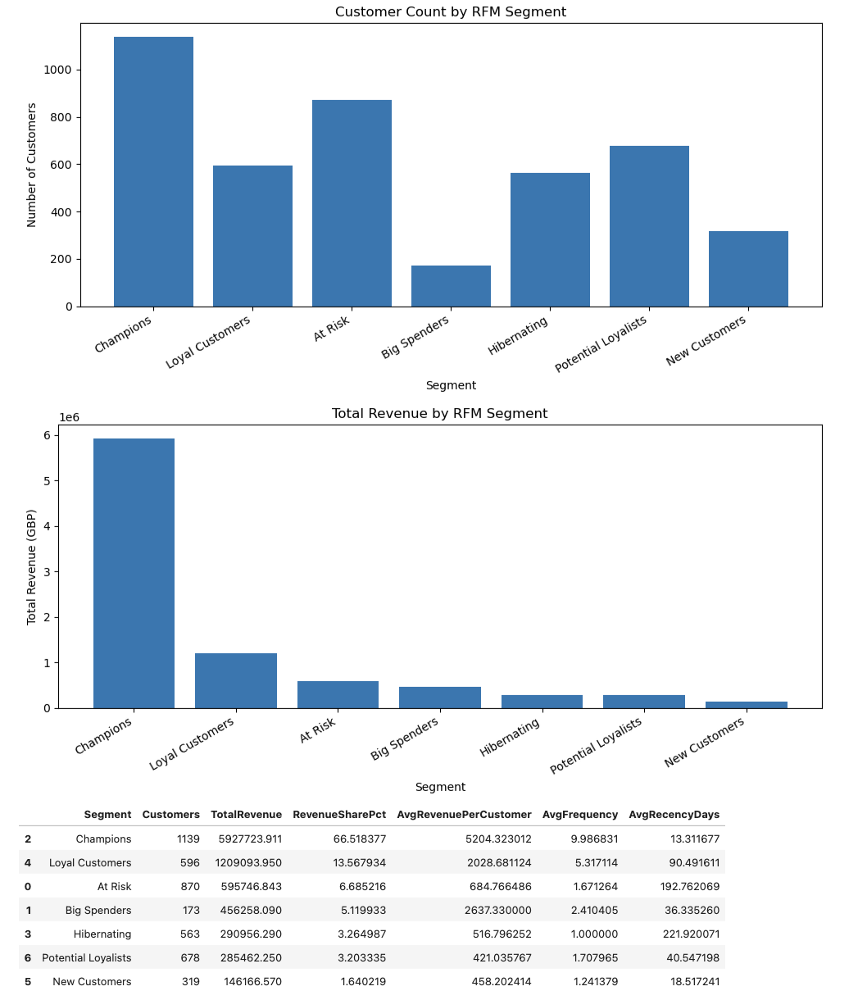
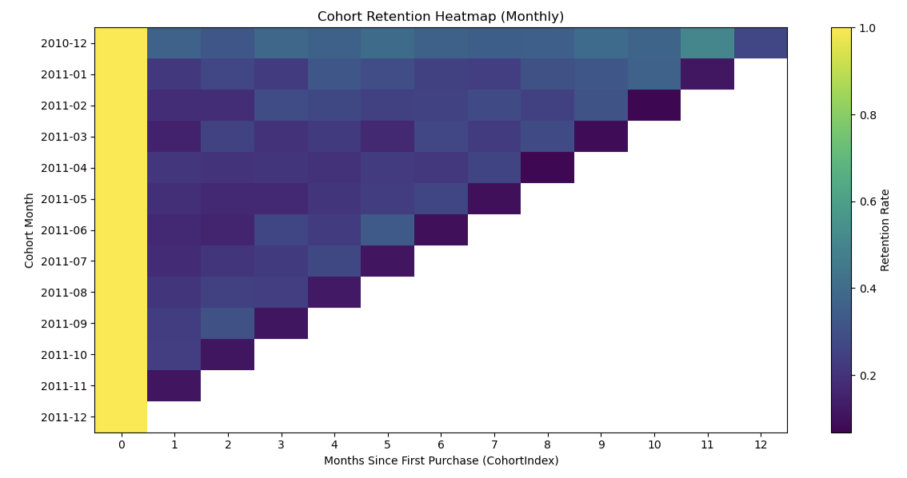
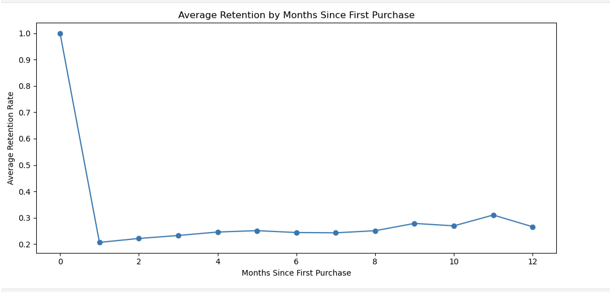
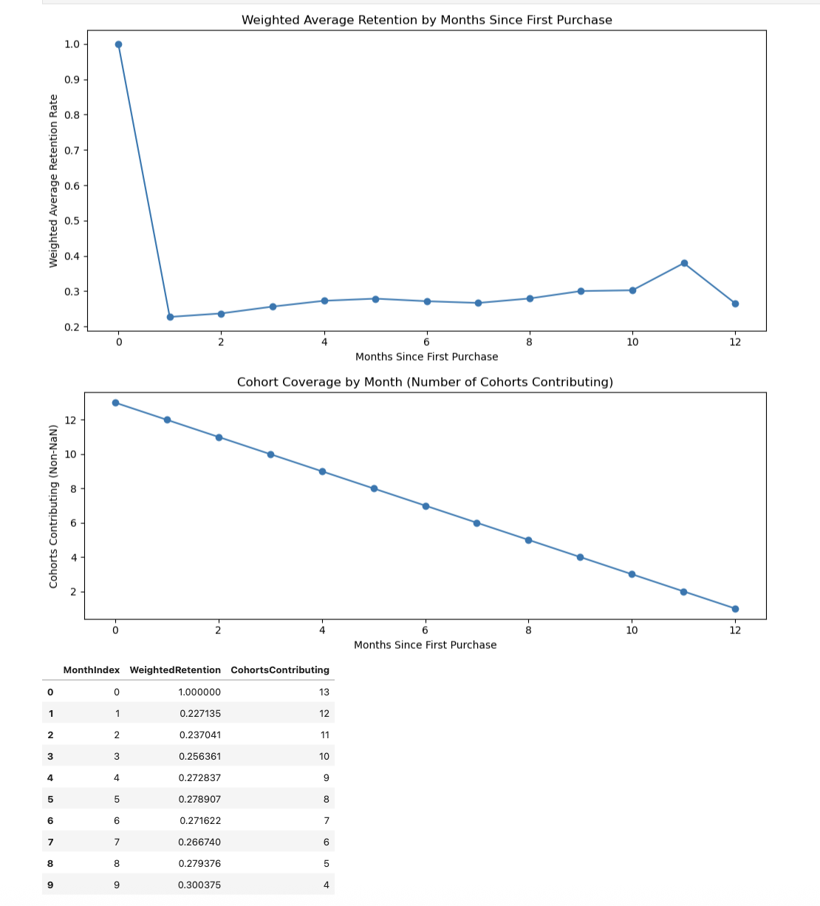
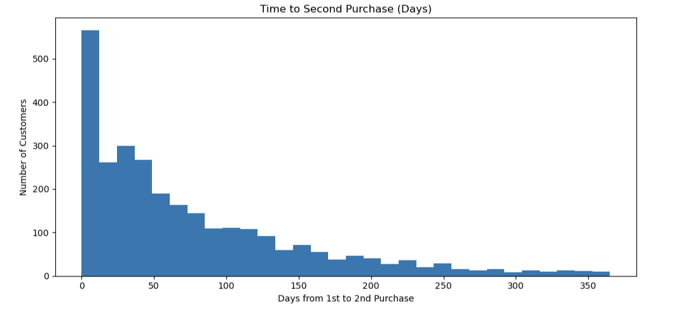
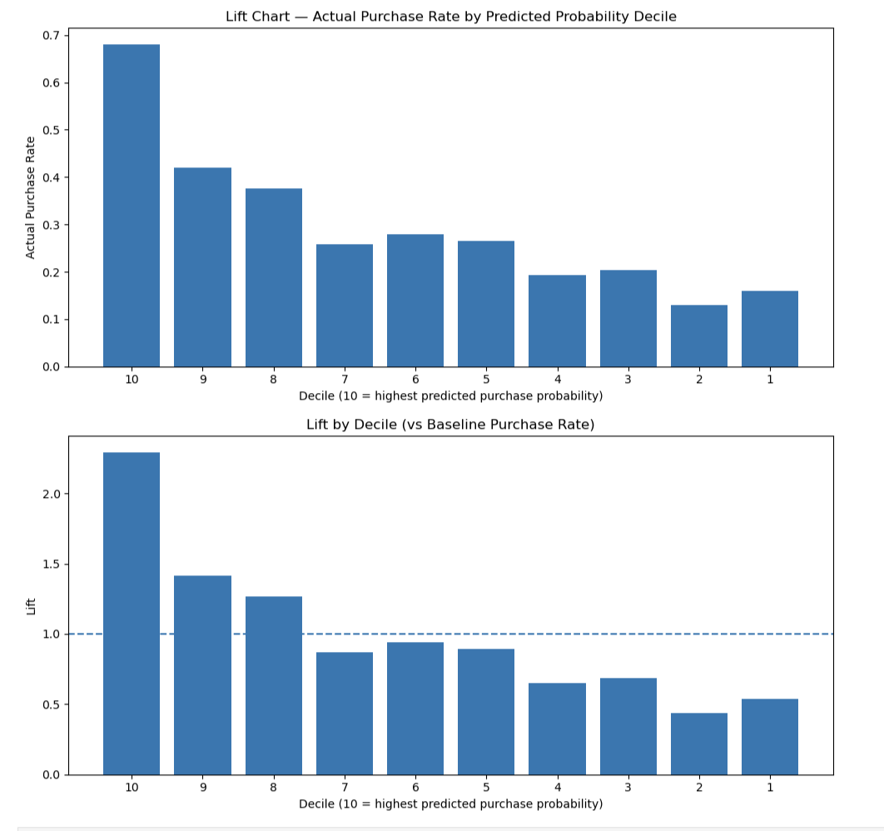
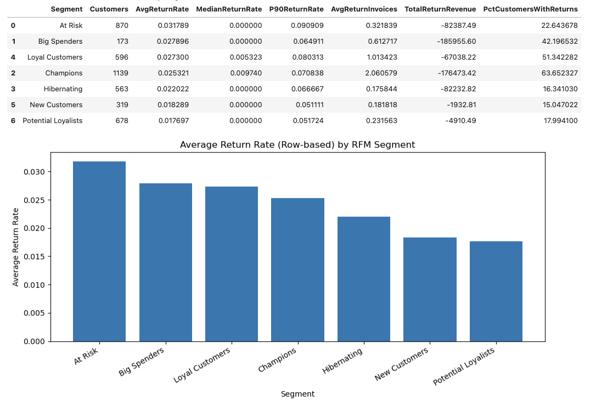

# Online Retail Customer Analytics: Segmentation, Retention, and Re-Purchase Risk

## Overview
This project analyzes a UK-based online retail transactional dataset to understand customer behavior and generate actionable business insights. The analysis focuses on customer segmentation, retention patterns, repeat purchase behavior, return/cancellation behavior, and short-horizon re-purchase risk.

The project was built as an end-to-end applied data science case study using Python in Jupyter Notebook, with emphasis on both business interpretation and technical rigor.

## Business Problem
For an online retail business, understanding customer value and retention is essential for improving revenue and customer engagement. This project addresses the following questions:

- Who are the most valuable customers?
- Which customer segments contribute the most to revenue?
- How well are customers retained over time?
- How quickly do customers return for a second purchase?
- Which customers are at high risk of not purchasing again soon?
- How do returns and cancellations affect true customer value?

## Project Objectives
The main objectives of this project are:

1. Build customer segments using RFM analysis  
2. Measure customer retention using cohort analysis  
3. Analyze repeat purchase behavior  
4. Model short-horizon re-purchase risk using customer-level features  
5. Incorporate returns and cancellations into value estimation using NetRevenue  
6. Identify high-value, high-risk customers for possible win-back actions  

## Dataset
This project uses the **Online Retail Dataset**, a UK-based non-store online retail transactional dataset.

**Source:** https://www.kaggle.com/datasets/ulrikthygepedersen/online-retail-dataset

### Available Variables
- **InvoiceNo** — unique invoice number; invoices starting with `C` indicate cancellation
- **StockCode** — product/item code
- **Description** — product description
- **Quantity** — number of units purchased
- **InvoiceDate** — date and time of transaction
- **UnitPrice** — item price in sterling
- **CustomerID** — unique customer identifier
- **Country** — customer country

## Tools and Libraries
- Python
- Jupyter Notebook
- pandas
- numpy
- matplotlib
- scikit-learn

## Methodology

### 1. Data Cleaning and Preparation
The dataset was cleaned to support accurate customer-level analysis.

Key preprocessing steps:
- Converted `InvoiceDate` to datetime format
- Converted `CustomerID` to a nullable integer type
- Flagged cancellations using `InvoiceNo` values starting with `C`
- Flagged return-like rows where `Quantity <= 0` or `UnitPrice <= 0`
- Separated true sales records from cancellations/returns
- Excluded rows with missing `CustomerID` for customer-level analysis

### 2. Invoice-Level Feature Engineering
Since each invoice can contain multiple line items, item-level rows were aggregated into invoice-level summaries:
- invoice value
- total basket size
- number of unique products

### 3. Customer-Level Feature Engineering
Customer-level features were created to describe purchase behavior:
- **Recency** — days since last purchase
- **Frequency** — number of unique invoices
- **Monetary** — total revenue from purchases
- **Average Order Value**
- **Average Basket Size**
- **Average Unique Items per Order**
- **Customer Age in Days**
- **Historical CLV** within the observed time window

### 4. RFM Segmentation
Customers were segmented using RFM scoring:
- **Recency**
- **Frequency**
- **Monetary**

Quantile-based scores were assigned from 1 to 5, and customers were grouped into interpretable segments such as:
- Champions
- Loyal Customers
- New Customers
- Big Spenders
- At Risk
- Hibernating
- Potential Loyalists

### 5. Cohort Retention Analysis
Cohort analysis was used to track retention behavior based on each customer’s first purchase month.

The project includes:
- cohort retention matrix
- cohort retention heatmap
- weighted retention curve
- cohort coverage curve to account for declining cohort availability over time

### 6. Repeat Purchase Behavior
Repeat purchase behavior was examined by calculating:
- repeat purchase rate
- time to second purchase
- distribution of days between first and second purchase

### 7. Short-Horizon Re-Purchase Risk Modeling
A logistic regression model was built to predict whether a customer would purchase again within the next 30 days.

Key modeling features included:
- Recency
- Frequency
- Monetary
- Average Order Value
- Average Basket Size
- Average Unique Items
- Customer Age

A time-safe cutoff date was used to prevent data leakage.

### 8. Return and Cancellation Behavior
Returns and cancellations were analyzed separately and then incorporated into customer-level value metrics.

The following were computed:
- number of return rows
- number of return invoices
- return revenue
- return rate per customer

### 9. NetRevenue Correction
To avoid overstating customer value, a corrected measure was created:

**NetRevenue = Monetary + ReturnRevenue**

Customers with non-positive net value were flagged as fully returned customers.

## Key Results
- **Champions contributed ~69.20% of NetRevenue**
- **Loyal Customers contributed ~13.74% of NetRevenue**
- **Repeat purchase rate was ~65.6%**
- **Median time to second purchase was 50 days**
- A logistic regression model achieved **ROC-AUC ≈ 0.692**
- **13 customers** were identified as both **high-value** and **high-risk**
- Fully returned customers represented **0.44%** of the customer base

## Repository Structure
```text
online-retail-customer-analytics/
├── online_retail_analysis.ipynb
├── README.md
├── .gitignore
└── images/
    ├── 01_rfm_segments_customers_revenue.png
    ├── 02_cohort_retention_heatmap.png
    ├── 03_avg_retention_curve.png
    ├── 04_weighted_retention_and_cohort_coverage.png
    ├── 05_time_to_second_purchase_hist.png
    ├── 06_lift_chart_deciles.png
    └── 07_returns_by_segment.png
Key Visualizations
1) RFM Segmentation (Customer Count + Revenue)

2) Cohort Retention Heatmap (Monthly)

3) Average Retention Curve (Unweighted)

4) Weighted Retention + Cohort Coverage (Censoring-aware)

5) Time to Second Purchase (Days)

6) Lift Chart (Model Targeting Quality)

7) Returns Behavior by Segment
 ```